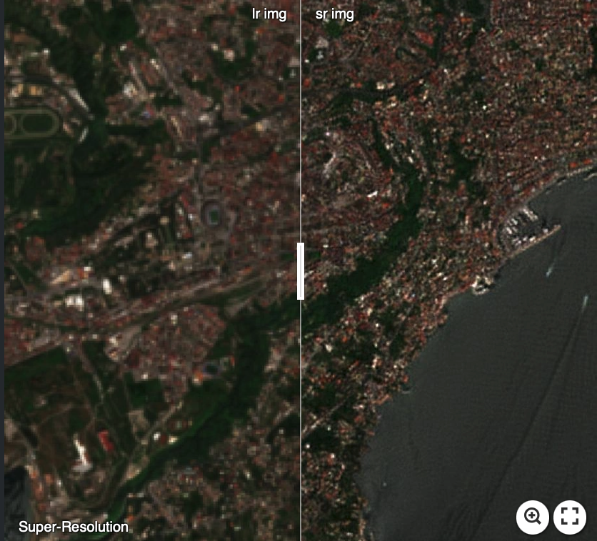
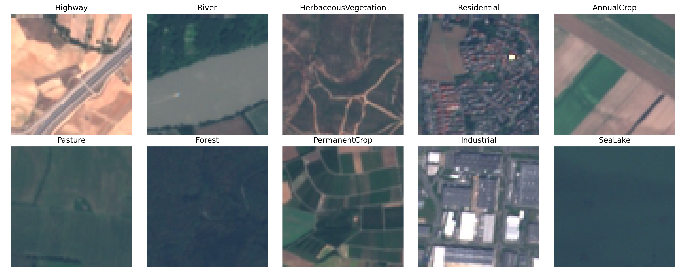
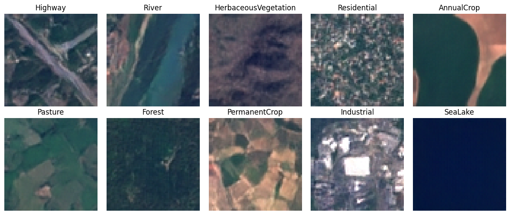
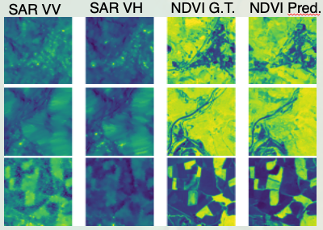

# Adaptation of Diffusion Models for Remote Sensing Imagery

## Summary of the files and folders 
In **train_diffusion_superres.py** there is the diffusion model class with all the functions to perform its sampling and its training. The **UNet_model_superres.py** is the python file of the UNet model used by the diffusion model to get the noise inside the images, just for the super resolution problem.

**train_diffusion_SAR_TO_NDVI.py** and **UNet_model_SAR_TO_NDVI.py** are used to solve the SAR to NDVI problem, but they work the same way. The UNet model has been structured in the same fashion of the super-resolution (instead of using the low resolution input image, we use the SAR image and instead of the high resolution image we use the NDVI image).

For the super-resolution and the SAR to NDVI problems there is the **superres_and_NDVIgen.py** file whose functions are used to perform and plot either the super-resolution generated images or the NDVI converted images (from the SAR ones).

In **utils.py** there are the functions used to create the datafolder for the super resolution task (data_organizer()) and also the get_data functions (for the super resolution and the SAR to NDVI) which create the dataset that will be input to the dataloader.

The **models_representation.pptx** is a power point file in which you can find a graphical representation of the UNet model architectures. 

**Aggregation_Sampling.py** is used after training to split an image into multiple patches, super resolve each patch and eventually gather the super resolved patches together in the Aggregation Sampling way explained in the paper https://arxiv.org/abs/2305.07015. 

**qr_code_builder.py** is a python file that creates a QR code according to the url you pass as argument.

Regarding the generative part, there are the training and sampling file (**train_diffusion_generation.py**) and the UNet model (**UNet_model_generation.py**) file in the folder **generate_new_imgs**. There is also the **utils.py** file but without the 
functions to create the datafolder and the dataset because in the generative case you must have a datafolder with inside a folder for each class and inside each classfolder the images. The **imgs_generator.py** file is the superres_and_NDVIge.py file for the generative case.


In the **models_run** folder there are the different models with their weights and some results relative to the dataset they are trained on. 

🚧🚧🚧🚧🚧  WORK IN PROGRESS 🚧🚧🚧🚧🚧

In **degradation_from_BSRGAN.py** there are functions taken from https://github.com/IceClear/StableSR to degrade the images in a more realistic way; these functions are then applied in the function get_data_superres_BSRGAN() of utils.py.  
<!-- In the folder **multihead_attention** there are files to implement the multihead attention mechanism in the UNet model instead of the simple attention. -->

## RESULTS

### SUPER RESOLUTION

[](https://imgsli.com/Mjc2NjAw)

Here is a video showcasing the denoising process for the super resolution problem of the Sentinel-2 dataset:


### IMAGE GENERATION of https://github.com/phelber/EuroSAT. 
The first set of images is the real one and the second set is the generated one.




### SAR TO NDVI

NDVI G.T. stands for Ground Truth NDVI, while NDVI PRED. stands for the predicted NDVI from the SAR image.



## TODO
- [ ] Add MultiHead Attention from Vision Transformer 
- [ ] Incorporate the Diffusion Model in a Latent Diffusion Model
- [ ] Substitute the simple Blur-Down-Gauss degradation with the BSR-degradation algorithm
- [x] ~~Improve the Aggregation Sampling (it is not working properly)~~
- [x] ~~The EMA model in train_diffusion_generation_COMPLETE.py doesn't work properly. It is a minor problem because in general the results with EMA are not different from the ones without it.~~
- [x] ~~Add Aggregation Sampling~~

## Train (snippet to train a super resolution model on the UP42 dataset with the DownBlur degradation)
```
python3 train_diffusion_superres_COMPLETE.py --epochs=1001 --noise_schedule='cosine' --batch_size=16 --image_size=256 --lr=1e-4 --snapshot_name=snapshot.pt --model_name="Residual_Attention_UNet_superres_magnification2_LRimgsize128_up42_sentinel2_patches_downblur" --noise_steps=1500 --patience=50  --dataset_path='up42_sentinel2_patches' --inp_out_channels=3 --loss='MSE' --magnification_factor=2 --UNet_type='Residual Attention UNet' --Degradation_type='DownBlur' --multiple_gpus='False' --ema_smoothing='True' --Blur_radius=0.5
```
## Contact
If you have any questions, feel free to contact me at `adriano.ettari@unina.it` or on my linkeding page [](https://www.linkedin.com/in/adriano-ettari-b8741b21b/)

